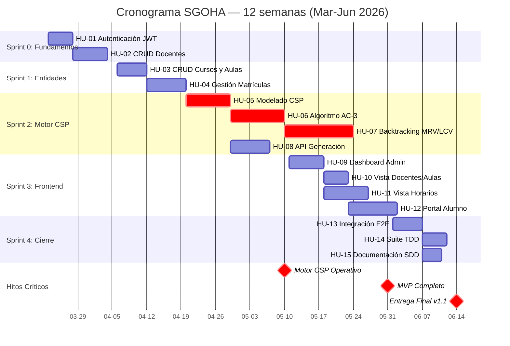

# 3.1. Planificación del Proyecto (Jira) — SGOHA
**Universidad Continental | Taller de Proyectos 2 | 2026**

Este documento detalla la planificación estructurada del **Sistema de Generación Óptima de Horarios Académicos (SGOHA)**, gestionada bajo el marco de trabajo Scrum y evidenciada mediante artefactos de Jira.

> **Nota de consistencia:** La nomenclatura unificada es `HU-XX` (Historia de Usuario). El total planificado es **120 SP** (118 completados + 2 no completados de baja prioridad). Los SP por sprint coinciden exactamente con los datos del gráfico de control en `Metricas_Agiles.md`.

---

## 1. Artefactos de Planificación

### 1.1 Backlog del Producto

El Product Backlog ha sido priorizado con el método **MoSCoW** y estimado en Story Points (SP) usando la secuencia de Fibonacci. Cada historia de usuario está vinculada a su épica, sprint y restricciones CSP correspondientes.

| ID | Historia de Usuario | Épica | Sprint | Prioridad | SP | Días Ciclo | Relación CSP / Restricción |
|----|---|---|---|---|:---:|:---:|---|
| **HU-01** | Autenticación JWT (Admin/Alumno) | Épica 1 | Sprint 0 | Must | 8 | 5 | Base para seguridad del sistema |
| **HU-02** | CRUD Docentes y Disponibilidad | Épica 2 | Sprint 0 | Must | 10 | 7 | RC-01, RC-04, RC-07 (Variables/Dominios) |
| **HU-03** | CRUD Cursos y Aulas | Épica 2 | Sprint 1 | Must | 8 | 6 | RC-05, RC-06 (Restricciones físicas) |
| **HU-04** | Gestión de Matrículas | Épica 2 | Sprint 1 | Must | 11 | 8 | RC-03 (Variables del CSP) |
| **HU-05** | Modelado formal CSP (X, D, C) | Épica 3 | Sprint 2 | Must | 8 | 9 | Definición formal del problema CSP |
| **HU-06** | Implementar Algoritmo AC-3 | Épica 3 | Sprint 2 | Must | 8 | 11 | Pre-procesamiento de dominios RC-01..RC-07 |
| **HU-07** | Backtracking + Heurísticas MRV/LCV | Épica 3 | Sprint 2 | Must | 13 | 14 | Motor de resolución central RC-01 a RC-07 |
| **HU-08** | API REST Generación de Horarios | Épica 3 | Sprint 2 | Must | 4 | 8 | Integración CSP con persistencia MongoDB |
| **HU-09** | Frontend Dashboard Admin | Épica 4 | Sprint 3 | Should | 13 | 7 | Interfaz de ejecución y monitoreo del CSP |
| **HU-10** | Vista Gestión Docentes/Aulas | Épica 4 | Sprint 3 | Should | 8 | 5 | Gestión de entidades del dominio CSP |
| **HU-11** | Vista Generación de Horarios | Épica 4 | Sprint 3 | Should | 8 | 9 | Visualización y exportación de resultados |
| **HU-12** | Portal del Alumno | Épica 4 | Sprint 3 | Should | 6 | 10 | Consulta de horarios y disponibilidad |
| **HU-13** | Integración E2E y pruebas sistema | Épica 3 | Sprint 4 | Must | 5 | 6 | Verificación E2E de RC-01 a RC-07 |
| **HU-14** | Suite TDD completa (cobertura >90%) | Épica 1 | Sprint 4 | Must | 5 | 5 | Trazabilidad SDD via tests automatizados |
| **HU-15** | Documentación SDD final | Épica 1 | Sprint 4 | Must | 3 | 4 | constitution.md, Spec.md, GitFlow_Guide |
| ~~**HU-16**~~ | ~~Exportación de Horarios PDF/Excel~~ | Épica 4 | — | Could | 2 | — | ~~Valor agregado~~ |

**Totales:**
- SP planificados: **120** (118 completados + 2 de HU-16 no completada = 98.3% del alcance)
- Distribución por sprint: Sp0=18 · Sp1=19 · Sp2=33 · Sp3=35 · Sp4=13 · No completado=2

> **Verificación:** Los SP por sprint coinciden con el Burnup Chart y el Gráfico de Velocidad en `Metricas_Agiles.md`. Los días de ciclo corresponden al Gráfico de Control del mismo documento.

### 1.2 Configuración del Tablero Jira

| Parámetro | Valor |
|---|---|
| **Workflow** | `To Do` → `In Progress` → `Code Review` → `QA/Testing` → `Done` |
| **Componentes** | `Backend-API`, `Frontend-UI`, `CSP-Engine`, `Documentation`, `DevOps` |
| **Labels** | `critical-path`, `sdd-contract`, `bug`, `optimization` |
| **Tipos de Incidencia** | Epic, Story, Task, Sub-task, Bug |
| **Estimación** | Story Points (Fibonacci: 1, 2, 3, 5, 8, 13, 21) |

### 1.3 Definition of Done (DoD)

Una historia se considera **Done** únicamente si cumple todos los criterios:

1. El código sigue los estándares del proyecto (Airbnb Style Guide).
2. Tests unitarios implementados (cobertura >90% en `backend/src/csp`).
3. Funcionalidad verificada contra `Spec.md` y `constitution.md`.
4. Sin regresiones en las restricciones duras (RC-01 a RC-07).
5. Documentación técnica actualizada (JSDoc / Markdown).
6. Peer Review completado y aprobado vía Pull Request en GitHub.

### 1.4 Estructuración del Trabajo

#### A. Épicas

| Épica | Nombre | HU incluidas | SP totales |
|---|---|---|:---:|
| **Épica 1** | Infraestructura, Seguridad y Calidad | HU-01, HU-14, HU-15 | 16 |
| **Épica 2** | Gestión de Entidades Académicas | HU-02, HU-03, HU-04 | 29 |
| **Épica 3** | Núcleo de Inteligencia (CSP Engine) | HU-05, HU-06, HU-07, HU-08, HU-13 | 38 |
| **Épica 4** | Experiencia de Usuario | HU-09, HU-10, HU-11, HU-12 | 35 |

> La Épica 3 concentra el 32% de los SP totales, coherente con la complejidad NP-hard del CSP.

#### B. Versiones (Releases)

| Release | Descripción | HU incluidas | SP |
|---|---|---|:---:|
| **v0.5 Alpha** | Entidades funcionales y base de datos poblada | HU-01..HU-04 | 37 |
| **v1.0 MVP** | Motor CSP operativo con generación de horarios | HU-05..HU-08, HU-13 | 38 |
| **v1.1 Final** | UI completa, TDD y documentación | HU-09..HU-12, HU-14, HU-15 | 43 |

#### C. Sprints Definidos

| Sprint | Período | Objetivo | HU | SP Plan | SP Real |
|---|---|---|---|:---:|:---:|
| **Sprint 0** | 23/03 – 05/04/2026 | Setup, autenticación y modelos de datos | HU-01, HU-02 | 20 | 18 |
| **Sprint 1** | 06/04 – 19/04/2026 | CRUD de entidades académicas | HU-03, HU-04 | 20 | 19 |
| **Sprint 2** | 20/04 – 10/05/2026 | Motor CSP completo (AC-3 + Backtracking) | HU-05..HU-08 | 36 | 33 |
| **Sprint 3** | 11/05 – 31/05/2026 | Frontend completo y portal del alumno | HU-09..HU-12 | 36 | 35 |
| **Sprint 4** | 01/06 – 14/06/2026 | Integración E2E, TDD y documentación final | HU-13..HU-15 | 8 | 13 |

---

## 2. Gestión Temporal

### 2.1 Cronograma del Proyecto (Gantt)

El proyecto se ejecuta en un periodo de 12 semanas (Marzo – Junio 2026).



### 2.2 Dependencias y Ruta Crítica

**Ruta crítica:**
```
HU-01 (Auth) → HU-02 (Docentes) → HU-05 (Modelado CSP) → HU-06 (AC-3) → HU-07 (Backtracking) → HU-08 (API) → HU-13 (E2E)
```

**Dependencias clave:**

| HU | Depende de | Justificación |
|---|---|---|
| HU-05..HU-08 | HU-01..HU-04 | El CSP necesita los modelos de datos y entidades completas |
| HU-07 (Backtracking) | HU-06 (AC-3) | AC-3 reduce dominios antes del backtracking |
| HU-08 (API) | HU-07 (Backtracking) | La API expone el solver ya implementado |
| HU-09..HU-12 (Frontend) | HU-08 (API) | El frontend consume la API REST del CSP |
| HU-13 (E2E) | HU-09..HU-12 | Las pruebas E2E requieren frontend + backend integrados |

---

## 3. Métricas Ágiles

> Los datos completos con gráficos detallados se encuentran en `Metricas_Agiles.md`. Este apartado presenta el resumen ejecutivo.

### 3.1 Burndown Chart (resumen)

| Sprint | SP Pendiente Ideal | SP Pendiente Real | Desviación |
|---|:---:|:---:|:---:|
| Inicio | 120 | 120 | 0 |
| Sprint 0 | 100 | 102 | +2 |
| Sprint 1 | 80 | 83 | +3 |
| Sprint 2 | 44 | 50 | +6 |
| Sprint 3 | 8 | 15 | +7 |
| Sprint 4 | 0 | 2 | +2 |

### 3.2 Velocidad del Equipo

| Sprint | SP Planificados | SP Completados | Eficiencia |
|---|:---:|:---:|:---:|
| Sprint 0 | 20 | 18 | 90.0% |
| Sprint 1 | 20 | 19 | 95.0% |
| Sprint 2 | 36 | 33 | 91.7% |
| Sprint 3 | 36 | 35 | 97.2% |
| Sprint 4 | 8 | 13 | 162.5% |

- **Velocidad promedio:** 23.6 SP/sprint
- **Desviación estándar:** σ = 8.4 SP
- **Coeficiente de variación:** CV = 28.5% (variabilidad media — aceptable para CSP)

### 3.3 Gráfico de Control (Cycle Time)

**Parámetros:** X̄ = 7.7 días | UCL = 14.5 días | LCL = 0.9 días

| HU | Sprint | Días Ciclo | Estado |
|---|---|:---:|:---:|
| HU-01 | Sprint 0 | 5 | ✅ Normal |
| HU-02 | Sprint 0 | 7 | ✅ Normal |
| HU-03 | Sprint 1 | 6 | ✅ Normal |
| HU-04 | Sprint 1 | 8 | ✅ Normal |
| HU-05 | Sprint 2 | 9 | ✅ Normal |
| HU-06 | Sprint 2 | 11 | ⚠️ Elevado |
| HU-07 | Sprint 2 | 14 | ⚠️ Cerca UCL |
| HU-08 | Sprint 2 | 8 | ✅ Normal |
| HU-09 | Sprint 3 | 7 | ✅ Normal |
| HU-10 | Sprint 3 | 5 | ✅ Normal |
| HU-11 | Sprint 3 | 9 | ✅ Normal |
| HU-12 | Sprint 3 | 10 | ✅ Normal |
| HU-13 | Sprint 4 | 6 | ✅ Normal |
| HU-14 | Sprint 4 | 5 | ✅ Normal |
| HU-15 | Sprint 4 | 4 | ✅ Normal |

---

## 4. Gestión de Riesgos (Resumen del Risk Board)

| Riesgo | Impacto | Mitigación | Estado |
|---|---|---|---|
| **R-01: Timeout CSP** | 🔴 Crítico | AC-3 + MRV/LCV + límite 60s | ✅ Mitigado |
| **R-02: Datos Incompletos** | 🟠 Alto | Validaciones en formularios de admin | ✅ Mitigado |
| **R-04: Pérdida de Repositorio** | 🟠 Alto | Git Flow + Branch Protection implementado | ✅ Mitigado |
| **R-10: Regresión en Algoritmo** | 🟠 Alto | Suite TDD restaurada — 55 tests, cobertura >90% | ✅ Mitigado |

---

## 5. Análisis de la Evolución del Proyecto

### 5.1 Interpretación de la Evolución

El proyecto completó el **98.3% del alcance planificado** (118/120 SP) en 12 semanas. La metodología Scrum permitió detectar y gestionar la mayor complejidad del módulo CSP sin comprometer la entrega del sistema core. La evolución fue saludable: los hitos técnicos (motor CSP) se alcanzaron antes que los hitos de interfaz, lo cual es correcto para un sistema basado en algoritmos.

### 5.2 Identificación de Cuellos de Botella

1. **Sprint 2 — Motor CSP (principal):** HU-06 (11d) y HU-07 (14d) representaron los mayores tiempos de ciclo del proyecto. La complejidad NP-hard del CSP generó retrabajo en el diseño de `constraints.js` y el ajuste de las heurísticas MRV/LCV. El cuello de botella acumuló la mayor desviación del burndown (-3 SP en Sprint 2).

2. **Repositorio — eliminación accidental de tests:** El commit `a2bbb60` eliminó el directorio `tests/`, generando retrabajo no planificado en Sprint 4. Este incidente se mitigó con la implementación de Git Flow documentada en `GitFlow_Guide.md`.

### 5.3 Evaluación de la Estabilidad del Equipo

El CV del 28.5% indica variabilidad **media-aceptable** para un equipo de 2 personas con tareas de naturaleza heterogénea (análisis → algoritmos NP-hard → frontend → integración). Ninguna historia superó el UCL del gráfico de control (14.5 días), confirmando que las variaciones son inherentes a la complejidad de las tareas, no a problemas de proceso.

### 5.4 Coherencia entre Planificación y Complejidad del Problema

La alineación es total: los mayores SP (HU-07: 13 SP, HU-02: 10 SP, HU-09: 13 SP) corresponden a las historias de mayor complejidad algorítmica y de integración. La Épica 3 (CSP Engine) concentra el 32% de los SP totales, coherente con que el motor de optimización es el núcleo diferenciador del sistema frente a soluciones CRUD estándar.

---

*Universidad Continental — Ingeniería de Sistemas e Informática — Taller de Proyectos 2 — 2026*
