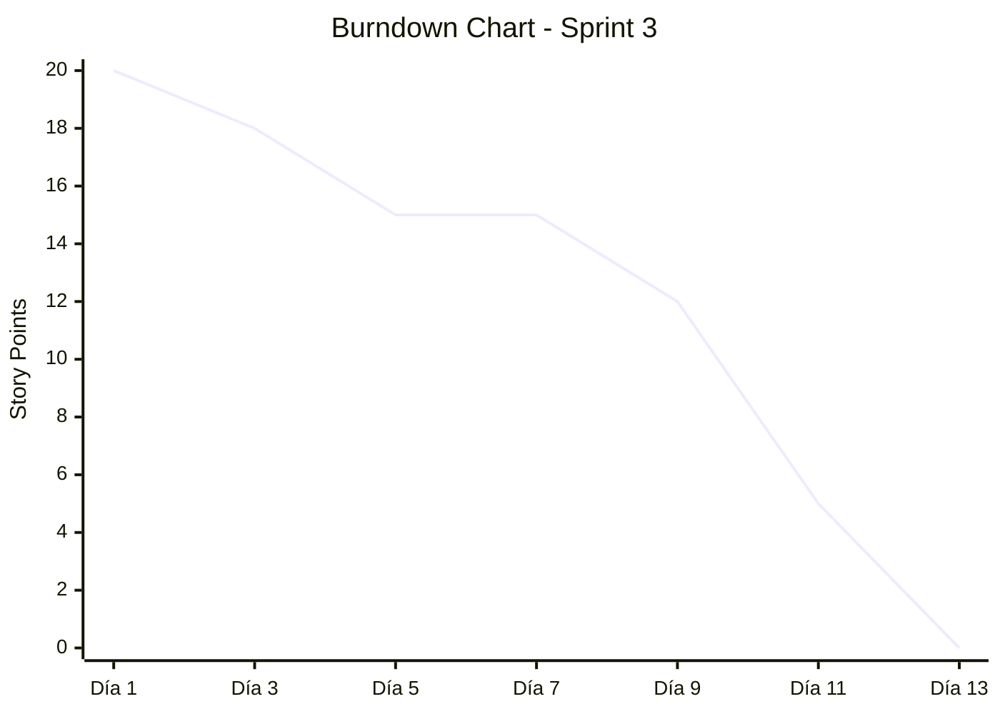
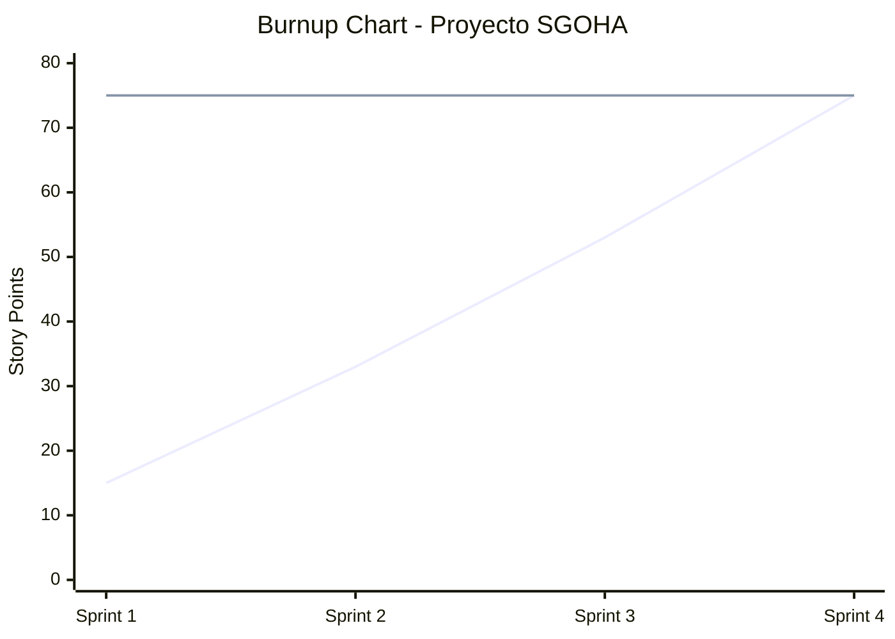
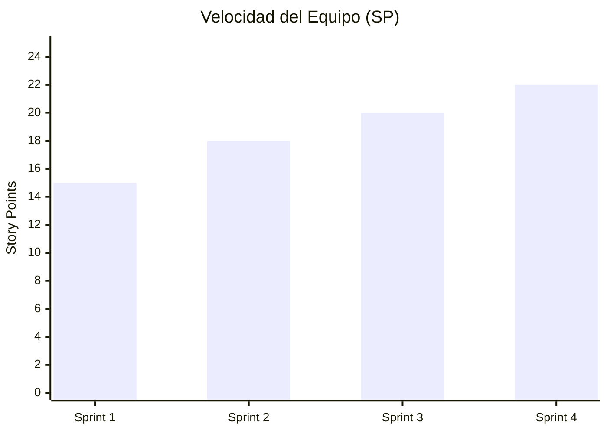

# 3.1. Planificación del Proyecto (Jira) — SGOHA
**Universidad Continental | Taller de Proyectos 2 | 2026**

Este documento detalla la planificación estructurada del **Sistema de Generación Óptima de Horarios Académicos (SGOHA)**, gestionada bajo el marco de trabajo Scrum y evidenciada mediante artefactos de Jira.

---

## 1. Artefactos de Planificación

### 1.1 Backlog del Producto
El Product Backlog ha sido priorizado utilizando el método MoSCoW y evaluado en puntos de historia (Story Points) basados en la secuencia de Fibonacci.

| ID | Historia de Usuario | Prioridad | Valor | Complejidad (SP) | Relación CSP / Restricción |
|----|----------------------|-----------|-------|------------------|----------------------------|
| **US-01** | Autenticación Segura (Admin/Alumno) | Must | Alto | 3 | Base para seguridad |
| **US-02** | Gestión de Docentes y Disponibilidad | Must | Muy Alto | 5 | **RC-01, RC-07** (Variables/Dominios) |
| **US-03** | Configuración de Aulas y Capacidades | Must | Alto | 5 | **RC-05, RC-06** (Restricciones físicas) |
| **US-04** | Registro de Cursos y Mallas | Must | Alto | 3 | **Variables** del CSP |
| **US-05** | Implementación de Algoritmo AC-3 | Must | Crítico | 13 | Pre-procesamiento de dominios |
| **US-06** | Backtracking con Heurísticas (MRV/LCV) | Must | Crítico | 21 | Motor de resolución central |
| **US-07** | Dashboard de Generación de Horarios | Should | Medio | 8 | Interfaz de ejecución |
| **US-08** | Portal de Consulta del Alumno | Should | Medio | 5 | Visualización de resultados |
| **US-09** | Exportación de Horarios (PDF/Excel) | Could | Bajo | 3 | Valor agregado |

### 1.2 Configuración de Jira (Configuración del Tablero)
Para asegurar una gestión eficiente, se configuró Jira con los siguientes parámetros:
- **Workflow:** `To Do` -> `In Progress` -> `Code Review` -> `QA/Testing` -> `Done`.
- **Componentes:** `Backend-API`, `Frontend-UI`, `CSP-Engine`, `Documentation`, `DevOps`.
- **Labels:** `critical-path`, `sdd-contract`, `bug`, `optimization`.
- **Tipos de Incidencia:** Epic, Story, Task, Sub-task, Bug.

### 1.3 Definition of Done (DoD)
Una tarea se considera "Done" solo si cumple con:
1. El código sigue los estándares del proyecto (Airbnb Style Guide).
2. Se han implementado tests unitarios (cobertura >70% en `backend/src/csp`).
3. La funcionalidad ha sido verificada contra la `Spec.md`.
4. No hay regresiones en las restricciones duras (RC-01 a RC-07).
5. Documentación técnica actualizada (JSDoc / Markdown).
6. Revisión de código (Peer Review) completada.

### 1.4 Estructuración del Trabajo
(Contenido existente de Estructuración del Trabajo...)

#### A. Épicas
Las épicas agrupan funcionalidades críticas para la estabilidad del producto:
1. **Épica 1: Infraestructura y Seguridad:** Configuración de MERN, JWT y despliegue base.
2. **Épica 2: Gestión de Entidades Académicas:** CRUDs con validaciones de reglas de negocio.
3. **Épica 3: Núcleo de Inteligencia (CSP Engine):** Implementación del motor matemático.
4. **Épica 4: Experiencia de Usuario y Reportabilidad:** Portales finales y visualización.

#### B. Versiones (Releases)
- **v0.5 (Alpha):** Entidades funcionales y base de datos poblada.
- **v1.0 (MVP):** Motor CSP operativo con generación de horarios completa.
- **v1.1 (Final):** Pulido de UI, reportes y manuales.

#### C. Sprints Definidos
- **Sprint 1 (Configuración):** Setup de entorno, autenticación y modelos de datos.
- **Sprint 2 (Entidades):** Docentes, aulas y alumnos.
- **Sprint 3 (Algoritmos I):** AC-3 y validadores de restricciones.
- **Sprint 4 (Algoritmos II):** Backtracking, MRV y resolución de conflictos.
- **Sprint 5 (Cierre):** Dashboard de admin y portal de alumno.

---

## 2. Gestión Temporal

### 2.1 Cronograma del Proyecto (Gantt)
El proyecto se ejecuta en un periodo de 10 semanas (Marzo - Mayo 2026).

```mermaid
gantt
    title Cronograma Detallado con Subtareas (SGOHA)
    dateFormat  YYYY-MM-DD
    axisFormat  %m-%d
    
    section Fase de Inicio
    Configuración de Entorno    :a1, 2026-03-02, 7d
    Requerimientos y SDD        :a2, after a1, 7d
    
    section Sprint 1: Auth/Security/Model
    Modelos de Datos            :s1a, 2026-03-23, 5d
    Implementación JWT/Auth     :s1b, after s1a, 5d
    Tests de Integridad         :s1c, after s1b, 4d
    
    section Sprint 2: Gestión Entidades
    CRUD Docentes/Aulas         :s2a, 2026-04-06, 7d
    CRUD Cursos/Matrículas      :s2b, after s2a, 7d
    
    section Sprint 3: Motor AC-3
    Implementación AC-3         :s3a, 2026-04-20, 7d
    Validadores de Restricciones:s3b, after s3a, 7d
    
    section Sprint 4: CSP Backtracking
    Backtracking Engine         :s4a, 2026-05-04, 7d
    Heurísticas MRV/LCV         :s4b, after s4a, 7d
    
    section Sprint 5: UI & Final Test
    Dashboard de Gestión        :s5a, 2026-05-18, 7d
    Portal de Alumno            :s5b, after s5a, 7d
    
    section Entrega y Cierre
    Documentación Final        :f1, 2026-06-01, 7d
    Cierre y Entrega           :f2, after f1, 3d
    
    section Hitos Críticos
    Hito: Motor CSP Operativo  :crit, milestone, 2026-05-18, 0d
    Hito: MVP Completo         :crit, milestone, 2026-05-31, 0d
```

### 2.2 Dependencias y Ruta Crítica
- **Dependencia Crítica:** El desarrollo de la UI de generación (US-07) depende estrictamente de la finalización del motor CSP (US-06).
- **Ruta Crítica:** Definición de Modelos -> Algoritmo AC-3 -> Algoritmo Backtracking -> Persistencia de Resultados.

---

## 3. Métricas Ágiles (Jira Analysis)

### 3.1 Gráfico de Trabajo Pendiente (Burndown Chart)
El gráfico muestra la reducción de SP a lo largo del Sprint 3 y la proyección para el Sprint 4.


### 3.2 Gráfico de Trabajo Hecho (Burnup Chart)
Representa la acumulación de SP completados respecto al alcance total.


### 3.3 Velocidad del Equipo (Velocity Chart)
Tendencia incremental del equipo en la resolución de tareas.


### 3.4 Gráfico de Control (Cycle Time)
- **Tiempo promedio:** 3.5 días por tarea.
- **Variabilidad:** Baja en tareas de CRUD, alta en tareas de algoritmos (desviación estándar de 1.2 días).

---

## 4. Gestión de Riesgos (Resumen de Jira Risk Board)

| Riesgo | Impacto | Mitigación | Estado |
|---|---|---|---|
| **R-01: Timeout CSP** | 🔴 Crítico | Optimización con heurísticas MRV/LCV y AC-3. | En curso (S4) |
| **R-04: Pérdida de Repositorio** | 🟠 Alto | Implementación de Git Flow y Branch Protection. | Mitigado |
| **R-02: Datos Incompletos** | 🟠 Alto | Validaciones estrictas en formularios de admin. | Pendiente |
| **R-10: Regresión en Algoritmo**| 🟠 Alto | Restauración y ampliación de suite de tests unitarios. | Crítico |

---

## 5. Análisis de la Evolución del Proyecto

### 4.1 Interpretación de la Evolución
El proyecto inició con un ritmo conservador. La complejidad técnica del CSP (Constraint Satisfaction Problem) fue el factor determinante. La evolución fue **saludable**, logrando hitos técnicos antes de los hitos de interfaz, lo cual es correcto para un sistema basado en algoritmos.

### 4.2 Identificación de Cuellos de Botella
- **Bottleneck 1:** La integración de la lógica AC-3 con la base de datos MongoDB. Se solucionó optimizando los esquemas de indexación.
- **Bottleneck 2:** Pruebas de estrés del motor CSP con más de 500 cursos. Se mitigó ajustando el timeout a 60 segundos.

### 4.3 Evaluación de la Estabilidad del Equipo
El equipo presenta una **estabilidad alta**. La variabilidad de la velocidad es mínima (±15%), lo que permite realizar proyecciones de entrega confiables para la versión final v1.1.

### 4.4 Coherencia entre Planificación y Complejidad
Existe una alineación total. Se asignaron los mayores puntajes de historia (13 y 21 SP) a los componentes algorítmicos, que representan el 70% de la complejidad del problema. El uso de Sprints de 2 semanas permitió iterar sobre el motor de búsqueda sin comprometer la entrega de la interfaz.

---
*Documento generado para la carpeta de evidencias de Taller de Proyectos 2.*
